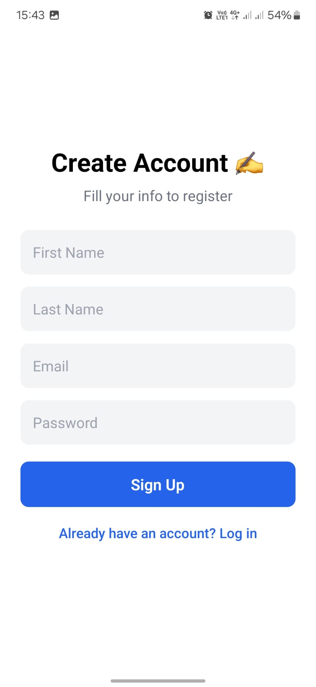
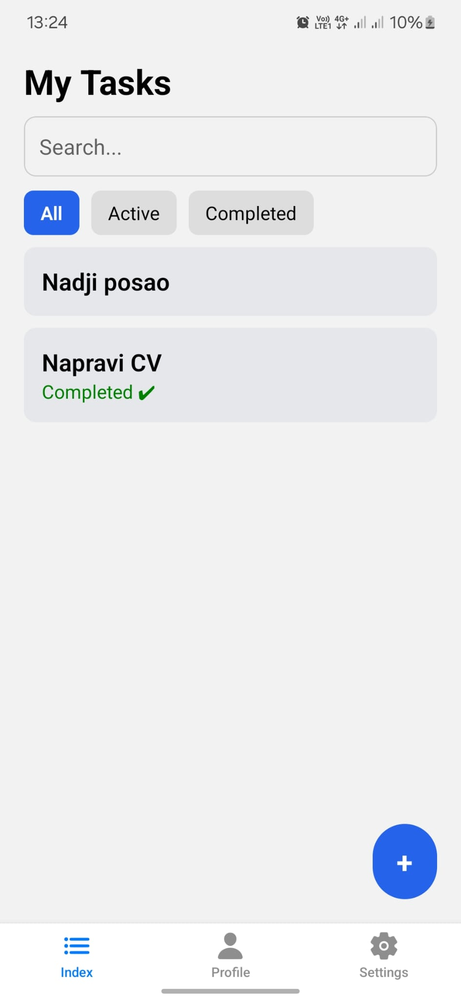

# Task Management App

Mobile task management application built with React Native.
Each user has their own account and personal task list stored in the database.

---

## ✨ Features
- User authentication (sign up / sign in)
- Create, edit and delete tasks
- Tasks are stored per user
- Secure backend with database and row-level access
- Navigation between multiple screens
- Persistent user session

---

## 🛠 Tech Stack
- React Native
- Expo
- JavaScript (ES6+)
- Supabase (Auth + Database)
- AsyncStorage

---

## 🗄 Backend (Supabase)
- Authentication using Supabase Auth
- PostgreSQL database
- Tasks linked to authenticated users
- Row Level Security (RLS) to protect user data

---

## 📱 Screenshots

